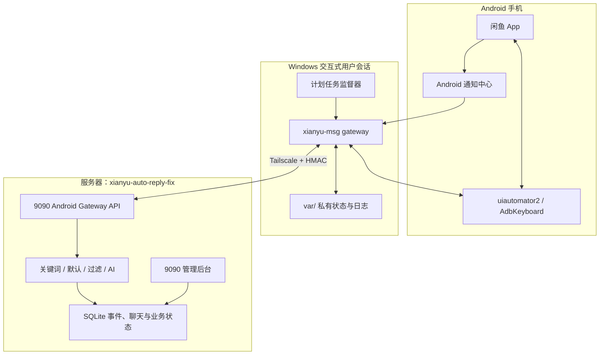
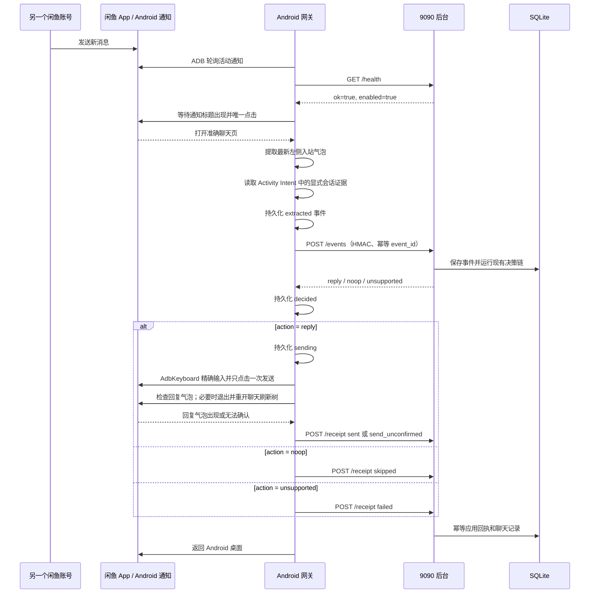
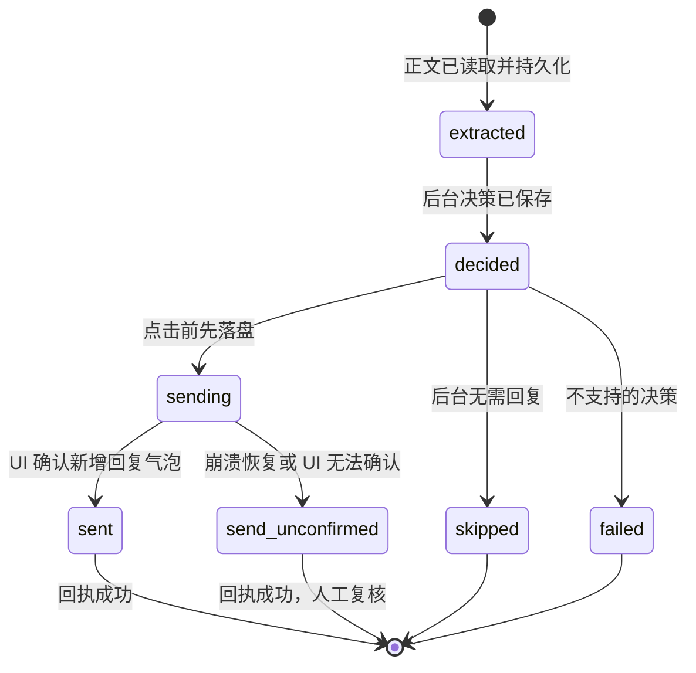

# 闲鱼 Android 消息网关架构方案

## 1. 设计目标

本项目把闲鱼消息的“传输能力”和“业务决策”分离：Android 手机是稳定的消息来源与发送
渠道，服务器项目 `xianyu-auto-reply-fix` 是唯一的业务后台。

目标：

- 通过真实闲鱼 App 接收自有账号的新消息；
- 将同一条消息幂等地交给 9090 后台；
- 复用后台现有关键词、默认回复、过滤和 AI 逻辑；
- 在已经由通知打开的准确聊天中最多点击一次发送；
- 把 `sent`、`skipped`、`send_unconfirmed` 或 `failed` 回传后台；
- 进程或 Windows 任务重启后能恢复未完成事件，同时优先避免重复回复。

非目标：

- 不在本仓库实现商品、买家、关键词或 AI 业务规则；
- 不主动扫描陌生人、群发营销或绕过平台风控；
- 不猜测 Android UI 没有提供的真实买家 ID、商品 ID 或 WebSocket 会话 ID；
- 当前不支持自动发送图片；
- 不承诺在闲鱼前台、通知被系统禁止或手机锁定时仍能可靠处理。

## 2. 系统上下文



## 3. 职责边界

| 组件 | 负责 | 不负责 |
|---|---|---|
| Android 网关仓库 | 通知检测、准确开聊、正文读取、事件投递、输入发送、回执、恢复 | 业务规则、账号 Cookie 生命周期、Web 管理界面 |
| 9090 后台仓库 | 账号白名单、Cookie、业务决策、事件幂等、聊天落库、回执应用 | 操作手机 UI、点击闲鱼发送 |
| 闲鱼 App | 实际消息展示与网络发送 | 为自动化提供稳定公开 API |
| Windows 计划任务 | 登录后常驻、故障重启、DPAPI 密钥保护、日志轮转 | Session 0 服务、无人登录时的 UI 自动化 |

`ANDROID_GATEWAY_ACCOUNT_IDS` 是两种传输方式的所有权开关。列入其中的账号由 Android
网关负责收发；后台不会为这些账号启动或恢复旧 WebSocket 自动回复通道，从而避免双发。

## 4. 主消息链路



### 事件标识

Android 端使用：

```text
event_id = SHA256(notification_fingerprint + NUL + body)
```

同一通知和正文会得到同一个事件 ID。服务器以 `event_id` 为主键，重复投递返回已缓存决策；
Android 的完成账本也按该 ID 去重。

### 会话身份

网关在聊天打开后读取 `dumpsys activity top`，只接受 Activity Intent 中显式的会话字段：
`sessionId/conversationId/chatId/cid` 与 `senderUserId/buyerId/otherUserId` 必须同时存在，
`itemId` 可选。完整证据以 `correlation_source=android_activity_intent` 随签名事件提交。

如果 App 没有暴露完整证据，后台只允许用五分钟内、正文一致且
`chat_id + sender_id + item_id` 上下文唯一的本地真实聊天记录关联；
遮罩昵称只用于缩小候选范围，不能生成身份。零个或多个候选都返回 `noop`，不会调用 AI/规则、
不会写入空身份聊天记录，也不会点击发送。系统不再用 `android:<hash>` 合成身份。

## 5. Android 发送一致性

核心取舍是“最多一次点击”，优先防止重复回复。



关键不变量：

- 进入 `sending` 后才允许触碰输入框；
- 一个工作流实例对发送按钮最多点击一次；
- 进程在点击边界崩溃后，恢复为 `send_unconfirmed`，不再自动点击；
- 回复气泡检查先读取当前可访问性树，超时后退出并按唯一标题重开一次聊天刷新树；
- 只有确认新增了精确、区分大小写的回复文本才产生 `sent`；
- `sent` 是本机 UI 发送确认，不代表对方已读。

这是一个有意的权衡：极少数不确定发送需要人工核对，但不会因为盲目重试产生重复回复。

## 6. 通知处理与恢复

通知由 `adb shell dumpsys notification --noredact` 轮询。只处理：

- 包名 `com.taobao.idlefish`；
- 配置白名单中的交易聊天频道；
- 带有可用于唯一定位的通知标题。

首次启动默认把当前活动通知记录为基线，不处理历史消息。常驻服务一旦创建了通知状态文件，
后续监督器重启会自动添加 `--include-existing`，因此“尚未确认但仍存在”的通知可以重放。

通知仅提供类似“发来一条新消息”的通用文本，正文必须在打开聊天后从最新左侧气泡提取。
聊天气泡只在屏幕中间区域解析，底部阈值为屏幕高度的 90%，以覆盖接近输入栏的新消息并排除
输入控件。

## 7. 输入法与坐标

闲鱼聊天页是 Flutter/自绘界面，标准控件树不总能直接点击或输入。当前实现：

1. 通过配置比例坐标点击输入框；
2. 临时切换到已经有人值守安装的 uiautomator2 `AdbKeyboard`；
3. 清空文本并精确提交回复；
4. 恢复发送前的系统输入法；
5. 点击无键盘状态下的黄色发送按钮坐标。

坐标与设备分辨率、闲鱼版本、系统字体和布局相关。变更任一因素后必须按
[设备准备与坐标校准](docs/device-calibration.md)重新验证。

## 8. 本地数据

| 数据 | 持久化位置 | 一致性作用 |
|---|---|---|
| 通知确认账本 | `var/gateway-notification-state.json` | 防止同一通知重复路由 |
| 网关交付账本 | `var/gateway-state.json` | 记录 pending 阶段并避免重复点击 |
| 常驻日志 | `var/service/gateway.log` | 启动、异常和 CLI 输出审计 |
| 只读通知事件流 | `var/inbound-notifications.jsonl` | `monitor` 模式诊断 |
| 本地待处理队列 | `var/inbound-pending.jsonl` | `inbox` 模式至少一次消费 |
| 队列消费状态 | `var/inbound-consumer-state.json` | 租约、重试和死信 |

状态文件使用临时文件加原子替换写入。`var/` 全部被 Git 忽略；其中仍可能出现聊天正文，
不能把“Git 忽略”误认为“无需保护”。

## 9. 安全设计

- Android 到后台通过 HTTPS、回环地址或 Tailscale CGNAT 地址访问；普通公网 HTTP 被拒绝；
- POST 使用 `HMAC-SHA256(timestamp + "\n" + raw_body)`；
- 服务器拒绝超过五分钟时间窗口的签名；
- 共享密钥不进入配置、命令行或仓库；
- Windows 常驻模式使用当前用户 DPAPI 加密密钥，并限制 `var/service` ACL；
- HTTP 客户端禁用环境代理，避免 Tailscale 请求被错误转发；
- 事件、决策和回执在服务器 SQLite 中保留用于幂等与审计；
- 截图只在显式要求时保留，并位于 Git 忽略目录。

## 10. 运行拓扑与约束

当前生产拓扑是单设备、单账号、单飞行中事件：

- Windows 用户必须保持登录，因为 ADB/UI 自动化不能可靠运行在 Session 0；
- 手机必须连接、授权并在需要操作时解锁；
- 闲鱼应位于后台以产生系统通知；
- 一个账号不能同时运行两个 Android 网关；
- 网关状态文件旁的 OS 所有权锁拒绝第二个进程；监督器 PID 消失时子进程自行退出；
- 通知标题若不唯一则失败关闭，不猜测会话；
- 聚合通知只保证提取最新可见入站气泡，超过屏幕范围的中间突发消息可能遗漏；
- 图片回复返回 `unsupported`；
- Android UI 变化可能要求重新校准。

## 11. 关键设计决策

| 决策 | 原因 | 影响 |
|---|---|---|
| Android 网关只做传输 | 复用成熟后台业务逻辑 | 两仓库边界清晰，必须保持协议同步 |
| 同步决策并保持当前聊天 | UI 没有稳定会话 ID 可供稍后重开 | 一个时刻只处理一个事件 |
| 计划任务而不是 Windows Service | UI 自动化依赖交互式用户会话 | 用户必须登录 |
| 通知路由而不是遍历消息列表 | 自绘消息列表缺少稳定节点 | 依赖通知权限和后台状态 |
| 点击前持久化 `sending` | 崩溃时避免重复发送 | 不确定结果需要人工复核 |
| AdbKeyboard 精确输入 | 系统输入法候选区会截断或滞留文本 | 首次安装需要人在手机上确认 |
| HMAC + Tailscale | 保护聊天正文和决策接口 | 两端时钟和密钥必须一致 |
| 真实身份关联失败关闭 | 错把两个买家或商品串线比漏回更危险 | 无唯一证据时跳过回复并留审计记录 |

## 12. 相关文档

- [详细模块架构](docs/architecture.md)
- [从零开始](docs/getting-started.md)
- [9090 后台对接](docs/server-gateway.md)
- [日常运维](docs/operations.md)
- [故障排查](docs/troubleshooting.md)
- [验收记录](docs/validation.md)

## 13. 变更历史

### 2026-08-10 - 单实例守护与真实身份失败关闭

**变更内容**：增加 OS 所有权锁、监督器 PID 联动、Activity Intent 显式身份证据，以及后台
真实会话/买家/商品上下文唯一性校验。

**变更理由**：防止重复网关争抢同一手机，并避免遮罩昵称导致买家或商品串线。

**影响范围**：Android 常驻服务、事件协议、后台关联决策、聊天落库和运维验收。

**决策依据**：无法唯一关联时漏回优于错误回复；商品上下文冲突与会话冲突同样失败关闭。
