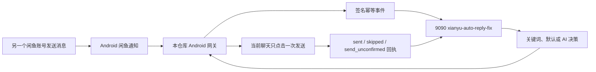

# 闲鱼 Android 消息网关

这是一个面向**自有闲鱼账号**的 Android 消息收发网关。它通过 ADB 和
`uiautomator2` 稳定取得闲鱼新消息、打开对应会话、执行一次文本回复，并把业务决策交给
独立的 `xianyu-auto-reply-fix` 后台。

项目的职责边界很明确：

- 本仓库负责 Android 通知检测、聊天页路由、消息正文读取、文本输入、单次发送和回执；
- 9090 后台负责账号配置、Cookie、关键词、默认回复、过滤和 AI 决策；
- Android 网关账号不依赖旧 WebSocket 消息通道，也不会与它重复发送。

当前版本已经在小米 13、Android 14、闲鱼 7.19.70 上完成真实
`notification → event → decision → Android reply → sent receipt` 验收。

## 推荐阅读顺序

第一次接手项目，请按顺序阅读：

1. [从零开始](docs/getting-started.md)：安装、手机准备、后台配置和第一次验收；
2. [配置说明](docs/configuration.md)：逐项理解 `config.json`；
3. [日常运维](docs/operations.md)：启动、停止、日志、升级和状态检查；
4. [架构方案](DESIGN.md)：两个仓库的职责、主链路和一致性设计；
5. [故障排查](docs/troubleshooting.md)：按现象定位常见问题。

更深入的实现文档见[文档导航](#文档导航)。

## 主链路



## 十分钟启动清单

### 1. 准备环境

- Windows 10/11；
- Python 3.11 或更高版本；
- Android Platform Tools，命令行可以执行 `adb`；
- 已登录目标账号的 Android 手机；
- 手机已开启“USB 调试”和“USB 调试（安全设置）”；
- Windows 与 9090 服务器已加入同一 Tailscale 网络。

### 2. 安装项目

```powershell
git clone https://github.com/kilbertert/XianyuMessageAutomation.git
cd XianyuMessageAutomation
python -m venv .venv
.\.venv\Scripts\python.exe -m pip install -e ".[dev]"
Copy-Item config.example.json config.json
```

修改私有的 `config.json`：

- `serial`：`adb devices` 显示的手机序列号；
- `gateway.base_url`：9090 后台的 Tailscale 地址；
- `gateway.account_id`：后台“账号管理”中的 Cookie ID；
- 坐标：首次可使用示例值，设备或闲鱼版本不同必须重新校准。

`config.json`、运行状态和聊天数据都被 Git 忽略。

### 3. 完成一次有人值守的输入法安装

网关使用 uiautomator2 的 `AdbKeyboard` 向 Flutter 输入框精确提交文本。第一次执行下列
命令时，手机可能弹出 APK 安装确认，必须在手机上同意：

```powershell
.\.venv\Scripts\python.exe -c "import uiautomator2 as u2; u2.connect('你的设备序列号').set_input_ime(True)"
```

安装完成后可以切回日常输入法；网关发送时会临时切换，并在输入后恢复原输入法。完整说明见
[设备准备与坐标校准](docs/device-calibration.md)。

### 4. 执行自检

```powershell
.\.venv\Scripts\xianyu-msg.exe --config config.json doctor
Invoke-RestMethod http://你的服务器Tailscale地址:9090/api/android-gateway/v1/health
```

期望：

- `doctor` 返回 `"ok": true`、正确的闲鱼版本和 `input_injection: true`；
- 健康接口返回 `ok: true`、`enabled: true`。

### 5. 安装常驻网关

使用与 ADB 会话相同的 Windows 用户运行：

```powershell
$secret = Read-Host "Android gateway shared secret" -AsSecureString
.\scripts\install_gateway_service.ps1 -SharedSecret $secret
```

安装器会创建当前用户登录后运行的计划任务 `XianyuAndroidMessageGateway`，并使用 Windows
DPAPI 保存共享密钥。不要同时手工运行第二个 `gateway` 进程。

```powershell
Get-ScheduledTask -TaskName XianyuAndroidMessageGateway
Get-Content .\var\service\gateway.log -Tail 50
```

生产运行细节见 [Windows 常驻服务](docs/windows-service.md)。

## 运行前必须知道

- 手机必须通过 ADB 保持 `device` 状态，并在需要操作 UI 时保持解锁；
- 闲鱼应停留在后台，手机回到桌面。闲鱼位于前台时系统可能不产生聊天通知；
- 目标账号必须已在 9090 后台导入有效 Cookie；
- `ANDROID_GATEWAY_ACCOUNT_IDS` 必须包含同一个 Cookie ID；
- 同一台手机、同一账号只能运行一个网关实例；
- `sent` 表示发送气泡已在闲鱼 UI 中确认，不等同于对方已经阅读；
- `send_unconfirmed` 表示发送按钮最多已经点击一次但 UI 无法确认，系统不会自动重发，
  必须人工检查聊天页。

## 命令定位

| 命令 | 用途 | 是否发送消息 |
|---|---|---:|
| `doctor` | 检查 ADB、设备、输入权限和闲鱼版本 | 否 |
| `unread` | 读取消息页未读数 | 否 |
| `screenshot-list` | 保存消息列表截图用于坐标校准 | 否 |
| `monitor` | 只监控闲鱼通知并输出 JSONL | 否 |
| `inbox` | 打开通知、提取正文并写入本地待处理队列 | 否 |
| `queue claim/ack/fail` | 消费本地队列 | 否 |
| `reply` | 对指定可见会话做 dry-run 或单次发送 | 仅 `--apply` |
| `gateway` | 生产主路径：后台决策后在当前聊天回复 | 是 |

所有参数以 CLI 为准：

```powershell
.\.venv\Scripts\xianyu-msg.exe --help
.\.venv\Scripts\xianyu-msg.exe gateway --help
```

## 项目结构

```text
XianyuMessageAutomation/
├─ src/xianyu_automation/   Python 包：通知、设备、工作流和持久化
├─ scripts/                 Windows 常驻任务安装、监督和卸载脚本
├─ tests/                   不依赖真机的单元与回归测试
├─ docs/                    使用、运维、协议、排障和验收文档
├─ config.example.json      可提交的配置模板
├─ config.json              私有运行配置，不提交
├─ var/                     私有状态、日志和截图，不提交
├─ DESIGN.md                总体架构方案
└─ pyproject.toml           Python 包和 CLI 入口
```

## 状态与隐私

`var/` 中可能存在聊天正文和通知标题，只允许当前运行用户访问，不应提交或复制到公开位置。
主要文件如下：

| 文件 | 作用 | 是否可能含正文 |
|---|---|---:|
| `var/gateway-state.json` | 网关崩溃恢复和已完成事件摘要 | 未完成时是 |
| `var/gateway-notification-state.json` | 已确认通知指纹 | 否 |
| `var/inbound-notifications.jsonl` | `monitor` 通知事件流 | 是 |
| `var/inbound-pending.jsonl` | `inbox` 本地待处理队列 | 是 |
| `var/inbound-consumer-state.json` | 队列租约、重试和死信状态 | 否 |
| `var/service/gateway.log` | 常驻服务日志 | 可能 |
| `var/artifacts/` | 显式保留的校准或验收截图 | 是 |

## 测试

```powershell
.\.venv\Scripts\python.exe -m pytest -q
```

自动测试覆盖通知解析与去重、路由、队列租约、HMAC 客户端、崩溃恢复、单次发送边界、
AdbKeyboard 输入、聊天重开确认和 Windows 服务脚本。真实设备结论见
[验收记录](docs/validation.md)。

## 文档导航

| 文档 | 适合什么时候看 |
|---|---|
| [从零开始](docs/getting-started.md) | 第一次部署和第一次真实消息验收 |
| [配置说明](docs/configuration.md) | 修改设备、坐标、通知或后台地址 |
| [日常运维](docs/operations.md) | 启停、日志、升级、备份和故障值守 |
| [总体架构方案](DESIGN.md) | 快速理解系统边界和关键设计决策 |
| [详细架构](docs/architecture.md) | 理解模块、状态机、数据与失败恢复 |
| [9090 后台对接](docs/server-gateway.md) | 配置另一个仓库和检查 API/回执 |
| [Windows 常驻服务](docs/windows-service.md) | 安装、检查、重启和卸载计划任务 |
| [入站检测与本地队列](docs/inbound-detection.md) | 使用 `monitor`、`inbox` 和 `queue` |
| [设备准备与坐标校准](docs/device-calibration.md) | 更换手机、输入法或闲鱼版本 |
| [故障排查](docs/troubleshooting.md) | 按现象快速定位问题 |
| [验收手册与记录](docs/validation.md) | 发布前回归或核对已验证能力 |

## 合规边界

本项目仅用于自有账号的授权工作流，不用于群发、骚扰、欺诈、规避平台限制或收集他人
隐私。请遵守闲鱼服务协议，并对聊天内容、Cookie、共享密钥、日志和截图采取最小权限保护。
